# Tiditalk

**Videoriunioni self-hosted per team e clienti** — WebRTC con SFU mediasoup, sul
tuo server, con Docker. Nessun account per gli ospiti, nessun cloud di terzi, il
tuo marchio.

🌐 Sito: [tastieredigitali.tech/casi-studio/tiditalk](https://tastieredigitali.tech/casi-studio/tiditalk/)

🇬🇧 [Read in English](README.md)

---

## Screenshot

<p align="center">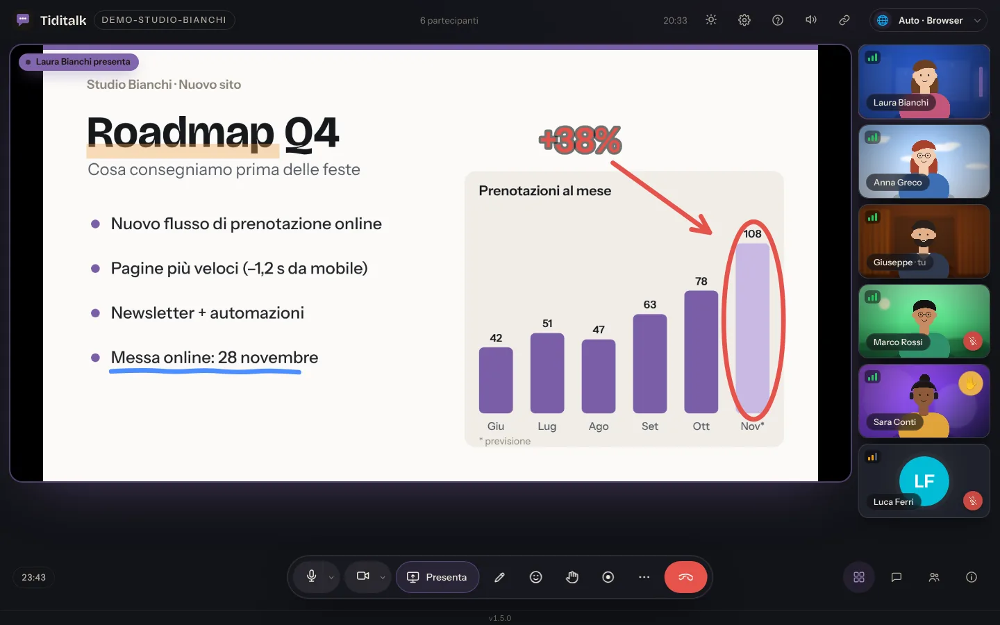</p>
<table>
<tr>
<td width="50%">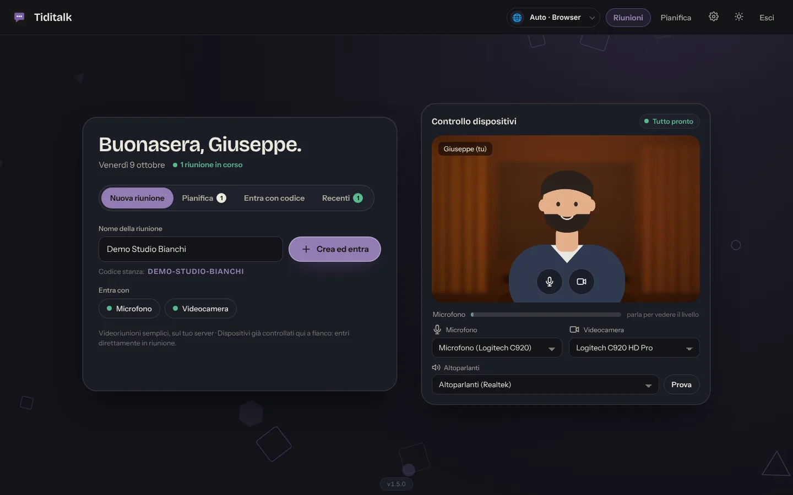<br><sub>Home: controllo dispositivi con anteprima della videocamera, livello del microfono e prova delle casse; nuova riunione con il codice stanza generato mentre scrivi</sub></td>
<td width="50%">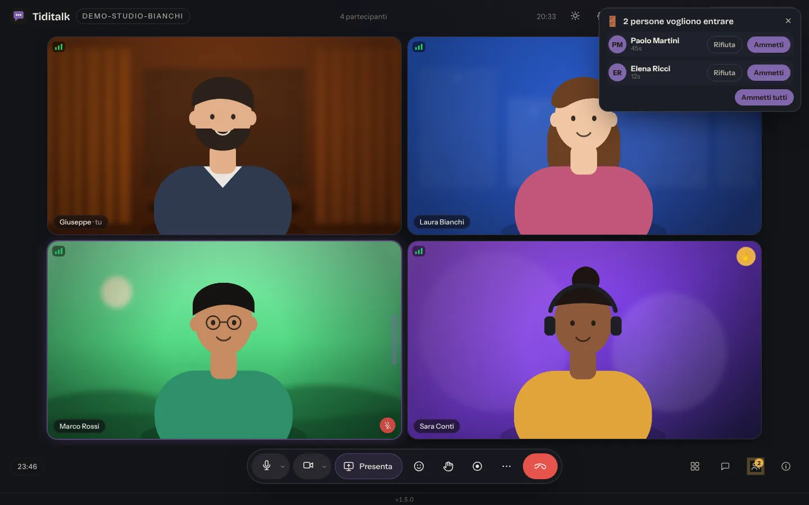<br><sub>Sala d'attesa come Google Meet: gli organizzatori ammettono o rifiutano gli ospiti da una scheda, badge sul pulsante Persone</sub></td>
</tr>
<tr>
<td width="50%">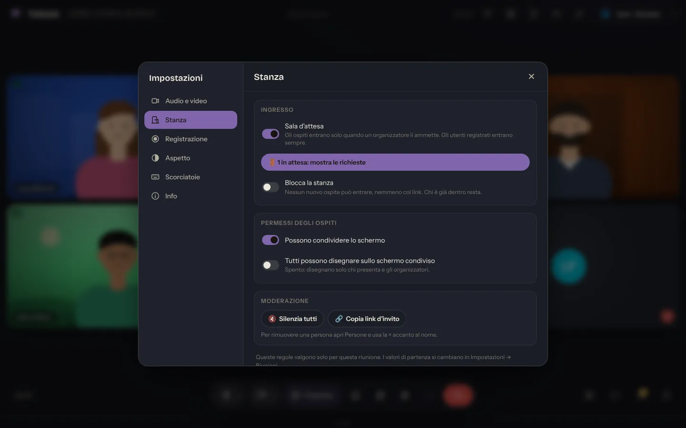<br><sub>Impostazioni della chiamata — sezione Stanza: sala d'attesa, blocco della stanza, permessi degli ospiti, silenzia tutti</sub></td>
<td width="50%">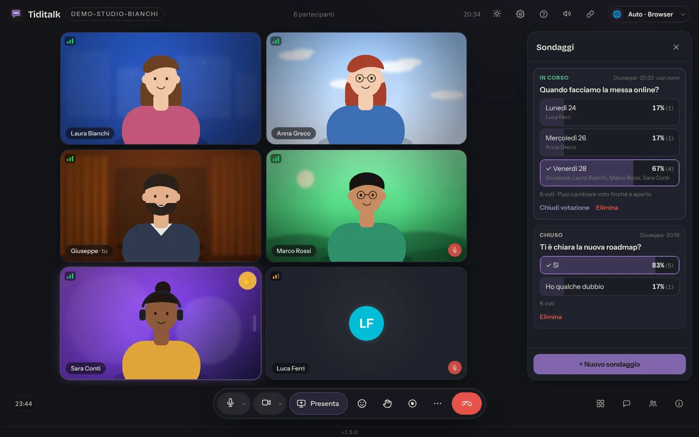<br><sub>Sondaggi: risultati in diretta, anonimi o con i nomi, si può cambiare voto finché è aperto</sub></td>
</tr>
<tr>
<td width="50%">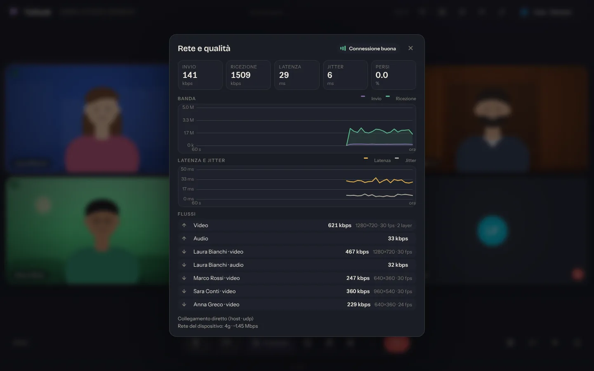<br><sub>Rete e qualità: grafici di banda, latenza e jitter, perdita pacchetti, una riga per flusso, percorso diretto o TURN</sub></td>
<td width="50%">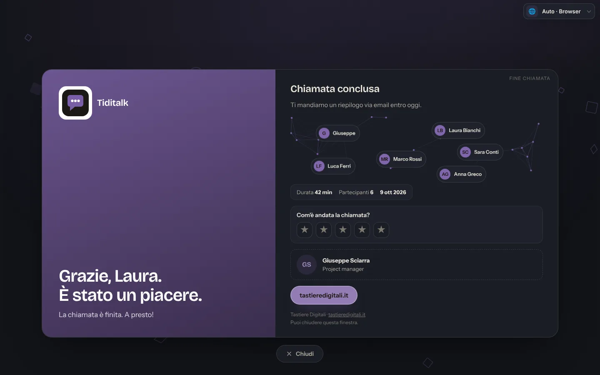<br><sub>Pagina di fine chiamata per gli ospiti: il tuo brand, costellazione dei partecipanti, voto a stelle, scheda contatto</sub></td>
</tr>
<tr>
<td width="50%">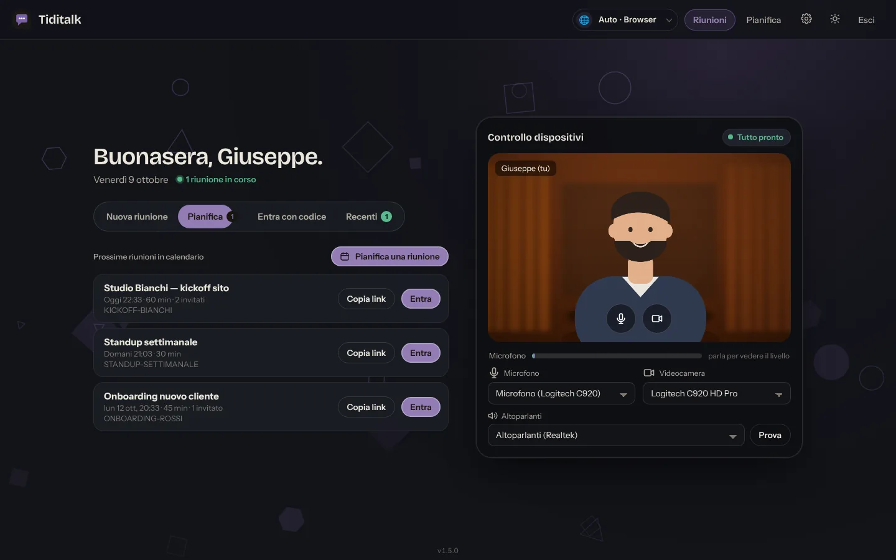<br><sub>Tab Pianifica: le prossime riunioni in calendario, con link d'invito e ingresso con un tocco</sub></td>
<td width="50%">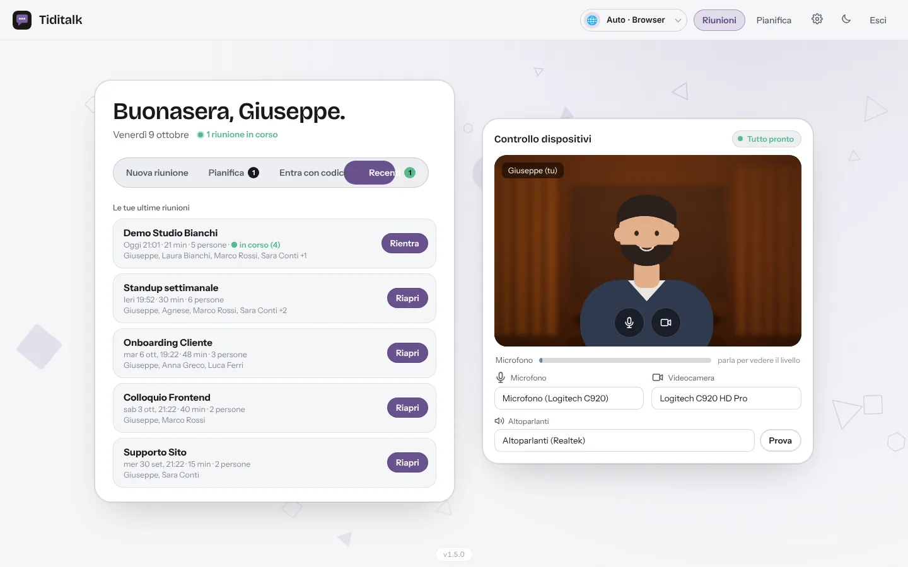<br><sub>Riunioni recenti: data, durata, chi c'era, badge "in corso", rientro con un tocco</sub></td>
</tr>
<tr>
<td width="50%">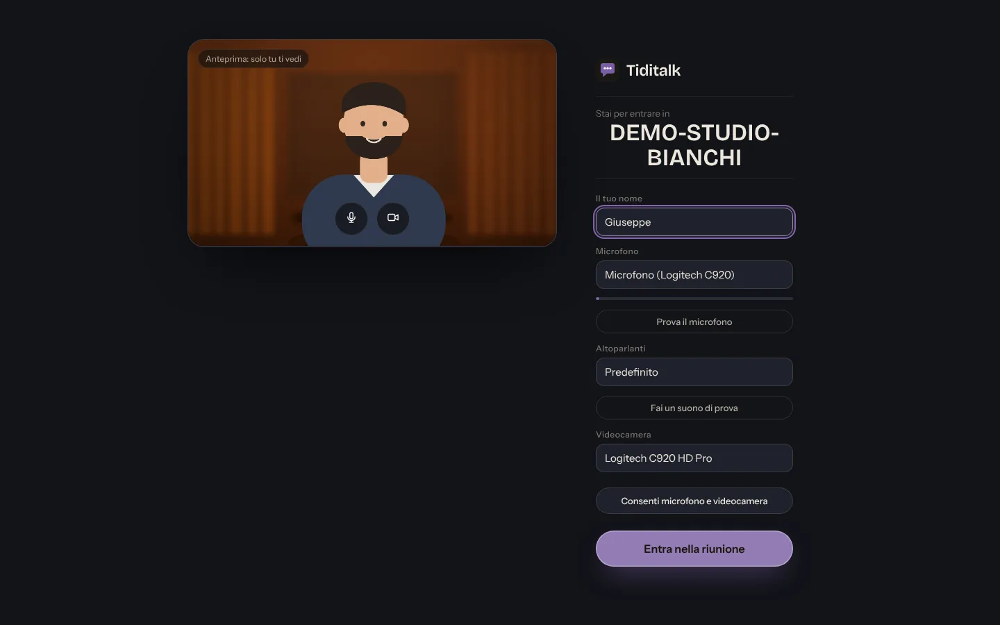<br><sub>Schermata di ingresso per gli ospiti: nome, prova del microfono, casse e videocamera</sub></td>
<td width="50%">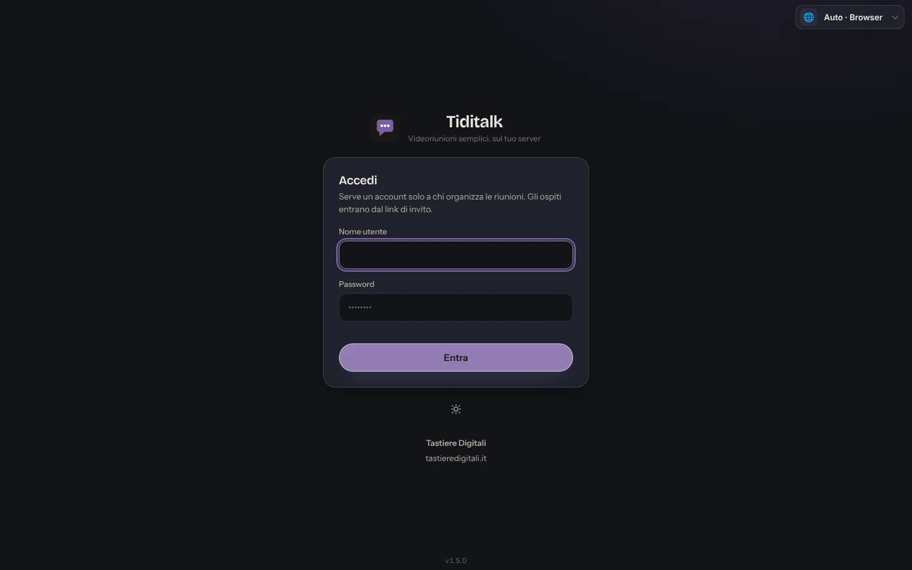<br><sub>Pagina di accesso con i dati dell'azienda impostati nel pannello</sub></td>
</tr>
</table>
<p align="center">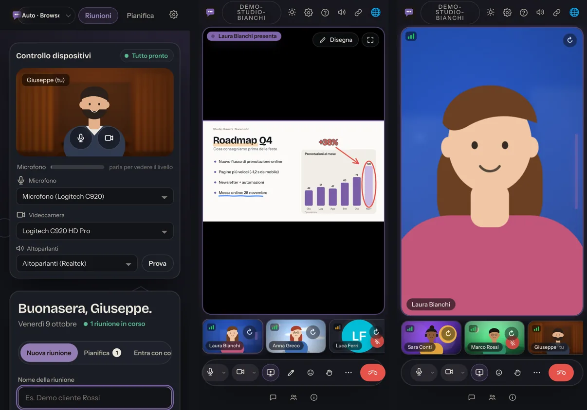<br><sub>Da telefono: home, condivisione schermo con annotazioni, vista relatore</sub></p>

<sub>Le persone negli screenshot sono illustrazioni inviate a una videocamera finta; tutto il resto è l'interfaccia reale.</sub>

---

## Funzionalità

**Riunioni**
- **Sala d'attesa** come Google Meet: gli ospiti aspettano che un
  organizzatore li ammetta (scheda Ammetti / Rifiuta / Ammetti tutti, attiva
  di default, disattivabile riunione per riunione); gli utenti registrati
  entrano subito; gli ospiti tornano in attesa se l'ultimo organizzatore
  esce. Gli organizzatori possono anche **bloccare la stanza** e rimuovere
  un ospite
- Home con il **controllo completo dei dispositivi** (anteprima videocamera,
  livello del microfono, prova delle casse) — gli utenti registrati entrano
  poi direttamente in riunione — più le **riunioni recenti** (data, durata,
  chi c'era, badge "in corso", un tocco per rientrare) e le prossime in
  calendario
- **Riunioni pianificate** con inviti via email ed evento `.ics` per il calendario
- Link ospite con scadenza, senza registrazione — funziona nel browser, da
  computer e da telefono
- Vista griglia che **adatta i riquadri allo spazio disponibile** (tutti
  visibili, stessa misura, 16:9, ultima fila centrata) e vista relatore
- Le camere verticali dei telefoni si vedono intere, non tagliate

**Presentare**
- Condivisione schermo con **disegno in diretta** sopra lo schermo condiviso:
  penna, evidenziatore, freccia, riquadro, cerchio, **testo**, **gomma** e
  **puntatore laser** col nome di chi indica; "nascondi disegni" solo per te,
  **salva un PNG** dello schermo condiviso con sopra i disegni
- Chi presenta decide se possono disegnare tutti o solo lui e gli organizzatori
- **Registrazione** locale che include disegni e puntatore laser; uscendo dalla
  stanza si aspetta che il file sia salvato

**Nella stanza**
- Chat, reazioni, alzata di mano, elenco partecipanti, **sondaggi** (li creano
  gli organizzatori, votano tutti, risultati in diretta, anonimi o con i nomi)
- **Push-to-talk**: da muto, tieni premuto Spazio per parlare
- **Riduzione rumore avanzata** (rete neurale RNNoise in WebAssembly, gira nel
  browser, nessun dato esce dal computer) — interruttore nel popup del microfono
- Finestra **Rete e qualità**: grafici live di banda, latenza e jitter,
  pacchetti persi, statistiche per flusso, percorso diretto o TURN
- **Pagina di fine chiamata per gli ospiti**: due colonne con il tuo brand,
  costellazione animata dei partecipanti, dati della chiamata, voto a stelle
  facoltativo, scheda contatto e bottoni — oppure reindirizzamento a un tuo URL
  (Impostazioni → Fine chiamata)
- **Finestra mobile** con tutta la riunione (Chrome/Edge): tutti i partecipanti,
  chi parla evidenziato, microfono/camera/mano/esci. Si apre da sola quando
  cambi scheda
- Sfondi virtuali (sfocatura o immagine), stili colore ed effetti viso (MediaPipe)
- **Finestra Impostazioni della chiamata** a sezioni: dispositivi audio e
  video, regole della stanza (organizzatori), qualità registrazione, aspetto,
  scorciatoie, info
- Popup del microfono con **livelli in tempo reale di microfono e casse** e
  interruttore della regolazione automatica del volume
- **Controllo del microfono**: se il sistema o un'altra app lo silenziano, o
  muore dopo un cambio dispositivo, viene riaperto senza interrompere la chiamata
- Qualità della connessione per ogni riquadro con statistiche, risparmio dati;
  condivisione nativa del link d'invito dal telefono
- Tooltip e scorciatoie da tastiera su ogni comando, guida iniziale facoltativa
- Tema chiaro e scuro, interfaccia in **italiano, inglese, francese e tedesco**

**Amministrazione**
- Pannello brand: nome, sottotitolo, logo, favicon, colore accento (adattato da
  solo per restare leggibile in entrambi i temi), tema, footer, dati azienda
- Utenti con ruolo **amministratore** e **organizzatore** — dal pannello o da `.env`
- Regole delle stanze: sala d'attesa, condivisione schermo ospiti, permessi di disegno, guida
- API REST esterna per creare riunioni e link ospite da un CRM
- **Aggiornamenti automatici quotidiani** con email di riepilogo, rollback
  automatico e comandi pronti per tornare indietro

---

## Requisiti

- Un server Linux con **Docker** e il plugin **Docker Compose**
- Un **IP pubblico** e un dominio
- Un reverse proxy con HTTPS e WebSocket (Nginx Proxy Manager, Traefik, Caddy,
  Nginx…)
- `systemd` per gli aggiornamenti pianificati (c'è su Debian/Ubuntu, anche nei
  container LXC); in mancanza si usa `cron`
- Queste porte raggiungibili da internet:

| Porta | Protocollo | Cosa |
|-------|------------|------|
| `PORT` (default 3010) | TCP | Web app — dietro il reverse proxy |
| `RTC_MIN_PORT`–`RTC_MAX_PORT` (default 40000–40400) | UDP + TCP | Media (mediasoup) — **dirette**, non dal proxy |
| 3478 | UDP + TCP | STUN/TURN (coturn) |
| `TURN_MIN_PORT`–`TURN_MAX_PORT` (default 49152–49200) | UDP | Relay TURN |

---

## Installazione

```bash
git clone https://github.com/Giuseppe-sciarra/TiDiTalk.git
cd TiDiTalk

# 1. Configurazione
cp .env.template .env
nano .env        # almeno: SERVER_SECRET, BASE_URL, ANNOUNCED_IP, TURN_*, USERS, SMTP_*

# 2. Asset di terze parti (MediaPipe per sfondi/effetti, immagini emoji)
bash setup-mediapipe.sh
bash setup-effects.sh

# 3. Avvio
docker compose up -d --build
docker compose logs -f app

# 4. Aggiornamenti automatici ogni giorno
bash install-cron.sh
```

`SERVER_SECRET` si genera con:

```bash
openssl rand -hex 32
```

`ANNOUNCED_IP` deve essere l'**IP pubblico numerico** del server: mediasoup non
risolve i nomi a dominio. Per un'installazione in italiano metti
`DEFAULT_UI_LANGUAGE=it`: è la lingua delle email quando il browser non ne
dichiara una.

Poi apri `BASE_URL`, entra con un utente di `USERS` e completa la configurazione
da **Impostazioni**.

---

## Utenti e ruoli

| Ruolo | Può |
|-------|-----|
| **admin** | tutto, comprese Impostazioni e gestione utenti |
| **host** | creare, pianificare e condurre riunioni |
| ospite | entrare da un link d'invito, senza account |

**Da `.env`** — creati all'avvio se mancano:

```dotenv
USERS=mario:PasswordRobusta1:Mario Rossi:admin,anna:PasswordRobusta2:Anna:host
USERS_MODE=create   # oppure "sync": .env diventa la fonte di verità
```

Le password possono essere anche hash bcrypt (`$2b$...`; dentro un env file di
compose il `$` si scrive `$$`). Con `USERS_MODE=sync` quegli utenti sono in sola
lettura nel pannello.

**Dal pannello** — Impostazioni → Utenti.

---

## Cosa sta dove

| Cosa | Dove |
|------|------|
| Nome, logo, favicon, colore, tema, footer, dati azienda | Impostazioni → Brand |
| Condivisione schermo ospiti, disegno per tutti, guida iniziale | Impostazioni → Riunioni |
| Utenti e password | Impostazioni → Utenti, oppure `USERS` in `.env` |
| SMTP, TURN, IP, porte, chiavi, API key, aggiornamenti | `.env` |

---

## Aggiornamenti

### Automatici (consigliato)

```bash
bash install-cron.sh           # ogni giorno alle 08:00 (ora locale del server)
bash install-cron.sh 6         # ...o a un'altra ora
bash install-cron.sh --status  # è pianificato? quando gira? ultimo esito
bash install-cron.sh --remove  # per toglierlo
```

`install-cron.sh` installa un **timer systemd** (persistente: se all'ora
stabilita il server era spento, l'aggiornamento parte appena si riaccende).
Senza systemd ripiega su cron e controlla che il servizio cron sia attivo.
L'ora è quella locale del server: se serve, imposta prima il fuso:

```bash
timedatectl set-timezone Europe/Rome && bash install-cron.sh
```

Ogni esecuzione di `auto-update.sh`:

1. se c'è una riunione in corso rimanda (3 volte da 15 minuti, poi procede);
2. porta **tutte** le dipendenze all'ultima versione, major comprese, e
   riallinea anche le versioni che nell'immagine sono più vecchie che su npm;
3. ricostruisce l'immagine e riavvia il servizio;
4. se entro 3 minuti il servizio non risponde, ripristina `package.json`, lock
   file e immagine precedenti — **rollback automatico**;
5. manda a `UPDATE_NOTIFY_EMAIL` la tabella di cosa è cambiato, con etichetta
   **major / minor / patch** e i comandi pronti per tornare indietro;
6. fa pulizia di Docker in modo sicuro: tiene le ultime `UPDATE_KEEP_ROLLBACK`
   immagini di rollback (default 5), toglie container fermi, immagini senza tag
   e cache di build più vecchia di 7 giorni. Non usa mai `prune -a`.

Backup: `backups/` (ultimi 10). Log: `logs/auto-update.log`.

| Variabile | Default | Significato |
|-----------|---------|-------------|
| `UPDATE_NOTIFY_EMAIL` | — | dove arriva il riepilogo |
| `UPDATE_MAIL_ALWAYS` | `0` | `1` = email anche quando non cambia niente |
| `UPDATE_SKIP_IF_BUSY` | `1` | rimanda se ci sono persone collegate |
| `UPDATE_BUSY_RETRIES` / `UPDATE_BUSY_WAIT` | `3` / `900` | quante volte / ogni quanti secondi |
| `UPDATE_KEEP_ROLLBACK` | `5` | immagini di rollback da tenere |
| `UPDATE_CHECK` | `0` | vecchia email "aggiornamenti disponibili", senza aggiornare |

### A mano

```bash
bash auto-update.sh --dry-run      # mostra cosa cambierebbe, senza toccare niente
bash auto-update.sh                # aggiorna adesso
docker compose up -d --build app   # dopo modifiche a server/ o public/assets/i18n
docker compose restart app         # dopo modifiche a CSS/JS/HTML (montati live)
```

---

## API esterna

Attiva se `EXTERNAL_API_KEY` è impostata. La chiave va nell'header `x-api-key`.

| Metodo | Endpoint | A cosa serve |
|--------|----------|--------------|
| `GET` | `/api/external/health` | stato |
| `POST` | `/api/external/generate-guest-token` | link ospite per una stanza |
| `POST` | `/api/external/schedule-meeting` | crea una riunione e manda gli inviti |
| `DELETE` | `/api/external/meeting/:id` | elimina una riunione |

`GET /api/health` (senza chiave) restituisce `{ ok, uptime, rooms, peers, version }`
ed è usato dall'aggiornamento automatico per non riavviare durante una chiamata.

---

## Scorciatoie da tastiera

`M` microfono · `V` videocamera · `S` presenta · `D` disegna · `H` alza la mano ·
`C` chat · `U` persone · `Spazio` tenuto premuto da muto per parlare (push-to-talk).
Mentre disegni: `P` penna, `E` evidenziatore, `A` freccia, `R` riquadro,
`O` cerchio, `T` testo, `X` gomma, `L` laser, `Ctrl+Z` annulla, `Esc` esci.

---

## Problemi frequenti

- **Audio/video non si collega per alcuni** — l'intervallo delle porte RTC va
  inoltrato in **UDP e TCP** e `ANNOUNCED_IP` deve essere l'IP pubblico. Dietro
  firewall rigidi è il TURN che salva la situazione: controlla `TURN_*`.
- **Camera o microfono bloccati** — la pagina deve essere servita in HTTPS.
- **Qualcuno si sente troppo basso** — popup del microfono (freccina accanto al
  microfono): la barra mostra il segnale reale. Se si muove appena, alza il
  volume d'ingresso nelle impostazioni audio del computer. Se il volume
  d'ingresso si abbassa da solo, spegni "Regola il volume del microfono
  automaticamente".
- **Eco** — di solito casse senza cuffie, o due dispositivi nella stessa stanza.
- **Gli inviti non arrivano** — Impostazioni → Sistema mostra lo stato SMTP e ha
  il pulsante per l'email di prova.
- **Gli aggiornamenti non partono** — `bash install-cron.sh --status`.
- **Diagnostica dalla console del browser** (organizzatori):
  `tdConnLog('Nome')` cadute ed eventi del microfono di un partecipante,
  `tdMicInfo()` stato reale del tuo microfono,
  `tdCamInfo()` risoluzione di anteprima, video inviato e camera.

---

## Licenza

Tiditalk è software libero rilasciato sotto
**GNU Affero General Public License v3.0 o successiva** — vedi [LICENSE](LICENSE).

Puoi usarlo, modificarlo e ridistribuirlo, anche commercialmente. Se offri una
versione **modificata** come servizio in rete, devi rendere disponibile il suo
codice sorgente a chi la usa: la finestra "Informazioni" di ogni stanza porta al
sorgente — imposta `SOURCE_URL` in `.env` perché punti al tuo fork.

Componenti di terze parti e relative licenze: [THIRD-PARTY.md](THIRD-PARTY.md).

Copyright © Giuseppe Sciarra — [Tastiere Digitali](https://tastieredigitali.it)

---

## Sostieni il progetto

Se Tiditalk ti è utile, puoi sostenerne lo sviluppo:

**[paypal.me/raxiel87](https://paypal.me/raxiel87)**

Segnalazioni di bug e pull request sono benvenute.
